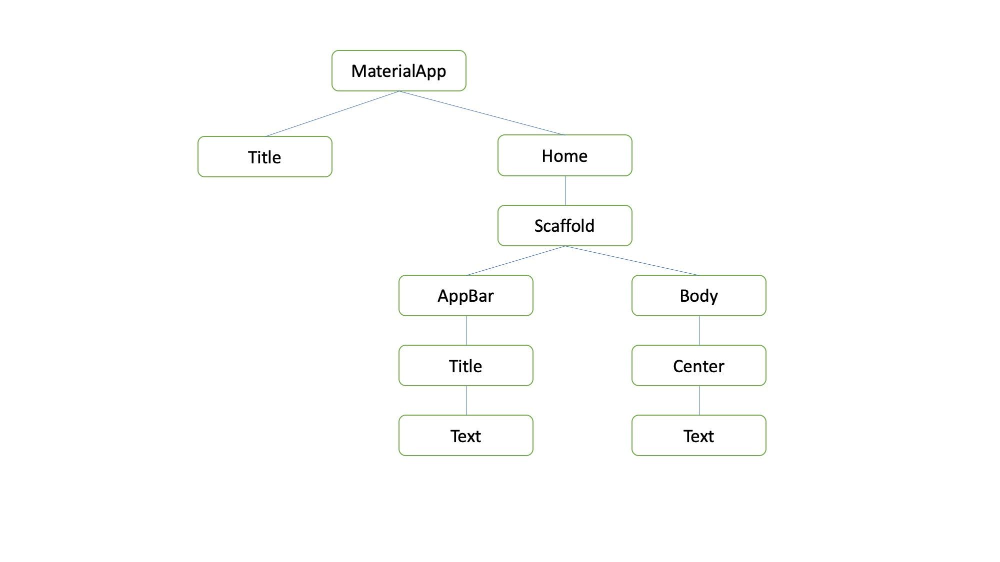

# Stateless Dan Stateful Widget
Hal yang paling mendasar yang seringkali ditanyakan oleh seorang developer atau programmer pada saat membuat aplikasi dengan flutter adalah <b><i>apa itu perbedaan Stateless dan Stateful Widget ?</i></b>   
Silahkan simak beberapa pengertian terkait perbedaan stateless dan stateful widget dibawah ini :   
<b>Stateful Widget</b> pada flutter menandakan bahwa sebuah component yang memiliki property state. Sebaliknya <b>stateless widget</b> lebih identik dengan sebuah component yang tidak memponyai properti state.   
Programming pattern menggunakan statful dan stateless component maksudnya adalah melewatkan atau mempassing state dari stateful component ke stateless component.   
Stateful dan stateless dapat juga diartikan dengan :   
<b>Stateful</b> : Dinamis, Menggunakan Session, Harus Login, sulit dibenarkan apabila ada website crash (lebih sulit dari statless).  
<b>Stateless</b> : Statis, tidak menggunakan session, tidak harus login, mudah dibenarkan apabila ada website crash.   
<b>Contoh penggunaan StatelessWidget :</b>
<pre>
class MyApp extends StatelessWidget{
    @override
    Widget build(BuildContext context) {
        return OneOrMoreWidgets;
    }
}
</pre>

Pejelasan :  
Pada code diatas kita dapat melihat bahwa nama class nya adalah <b>MyApp</b>, dan kemudian class MyApp ini meng <i>extend</i> ke StatelessWidget. Dan setiap widget akan memanggil <b>Widget Build(BuildContext ...)</b>   
<b>Contoh Penggunaan StatefulWidget</b>
<pre>
class MyApp extends StatefulWidget{
    @override
    State&lt;StatefulWidget> createState(){
        returen MyAppState();
    }
}
Class MyAppState extends State&lt;MyApp> {
    @override
    Widget build(BuildContext context){
        return OneOrMoreWidgets;
    }
}
</pre>

Penjelasan : 
Setiap kali kita menggunakan statefulWidget maka akan ada 2 buah kelas yang tebentuk. Yang pertama class extend dengan StatefulWidget dan yang kedua adalah Class yang extend ke state nya.
  

# Hirarki Widget Pada Flutter
Agar lebih memudahkan kita memahami struktur widget dari sebuah aplikasi flutter, kita dapat melihat bagan dibawah ini :  

 
<b>Penjelasan : </b>
 
Dari gambar diatas dapat kita lihat bahwa, untuk sebuah aplikasi flutter, kita membutuhkan yang namanya <b>MaterialApp</b>. Di dalam MaterialApp ini, nanti kita bisa menambahkan widget, Title dan Home. Dan untuk widget home memiliki properti yang di sebut dengan <b>AppBar</b> dan<b>Body</b>. Untuk widget AppBar memiliki property title dan text. Dan untuk body pada hirarki diatas memiliki property center dan text. Ketika body menggunakan properti center, maka semua widget yang ada didalam body akan terletak di tengah atau di center.